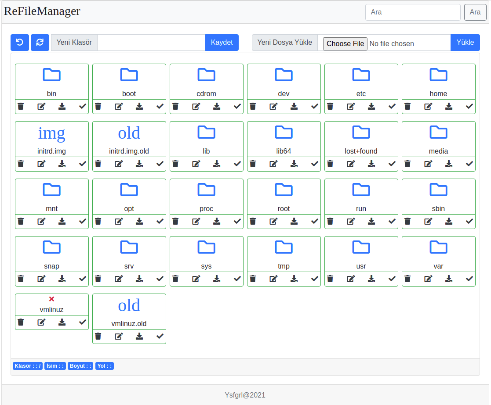
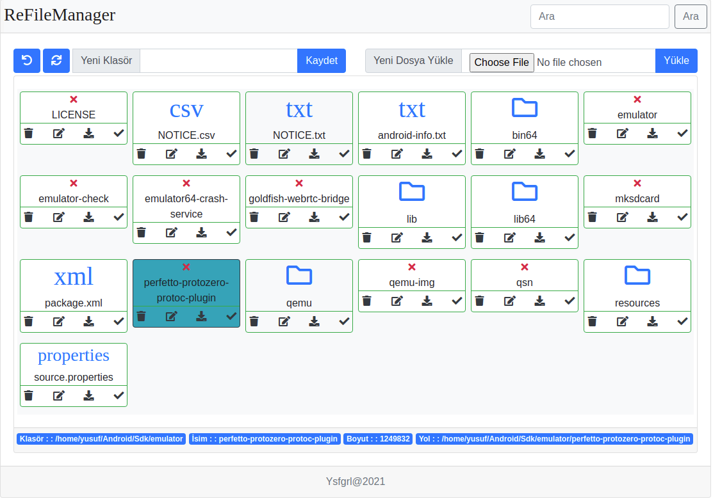

# ReFileManager

## About The Project

ReFileManager is written using javascript and php. You can easily delete, upload, download and list files. It can be easily integrated into your project :)






## Dependency

<details open="open">
  <summary> Dependency List </summary>
  <ol>
    <li>
      <a href="https://getbootstrap.com/docs/4.0/getting-started/introduction/">Bootstrap</a>
    </li>
    <li>
      <a href="https://jquery.com/download/">Jquery 3.4</a>
    </li>
    <li><a href="https://fontawesome.com/">Font Awesome</a></li>
  </ol>
</details>


## How To Use

This is an example of how to list things you need to use the software and how to install them.
    
* Html code
```
<html>
<head>

    <link rel="stylesheet" href="fontawesome-free">
    <link rel="stylesheet" href="bootstrap">
    
    <script src="jquery"></script>
    <script src="bootstrap"></script>
    <script src="jquery.form"></script>
    <script src="reFileManagerApi.js"></script>
    
</head>
<div id="fileManager">
    
</div>

```

* Javascript code
```
<script type="text/javascript">

$(document).ready(function(){

    var language = "tr";
    var contentId = "fileManager";
    var fileManagerRestUrl = "http://yourdomain/api.php";
    var api = new FileManagerApi(fileManagerRestUrl, contentId, locale);
    api.getFileList("/");
    
});
    
</script>

```